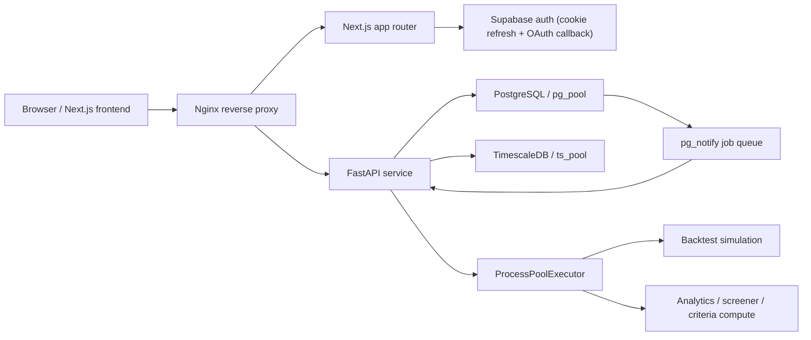

# Final Migration Architecture

The application now runs as a split web/API stack:



## Final Responsibilities

- Next.js keeps `middleware.ts` for Supabase cookie refresh.
- Next.js keeps `app/auth/callback/route.ts` for OAuth redirect handling.
- Nginx proxies every migrated `/api/*` path to FastAPI.
- FastAPI owns all business APIs, raw SQL access, background jobs, and the backtest engine.
- PostgreSQL stores relational app state, chart persistence, dashboards, feed state, and backtest strategies/runs/jobs.
- TimescaleDB stores historical market data and backtest trade logs.

## Runbook

1. Copy env vars into `.env` for both Next.js and FastAPI:
   - `NEXT_PUBLIC_SUPABASE_URL`
   - `NEXT_PUBLIC_SUPABASE_ANON_KEY`
   - `SUPABASE_JWT_SECRET`
   - `PG_DATABASE_URL`
   - `TS_DATABASE_URL`
2. Apply migrations:
   - `artha/supabase/migrations/20260322_chart_persistence.sql`
   - `artha/supabase/migrations/20260322_backtest.sql`
3. Seed the trading calendar if `nse_trading_calendar` is empty:
   - `python3 artha/scripts/seed_nse_calendar.py --database-url "$PG_DATABASE_URL" --csv /path/to/nse-calendar.csv`
4. Start the stack:
   - `docker compose -f artha/docker-compose.yml up --build`
5. Verify health:
   - `curl -s http://localhost/health | jq`
   - `curl -s http://localhost/api/backtest/meta/benchmarks | jq`
   - `curl -s http://localhost/api/charts/layouts -H "Authorization: Bearer $TOKEN" | jq`
6. Verify the backtest worker:
   - `curl -s -X POST http://localhost/api/backtest/run -H "Authorization: Bearer $TOKEN" -H "Content-Type: application/json" -d '{"strategy":{"name":"Smoke Test","position_type":"long","period_start":"2023-01-01","period_end":"2024-12-31"}}' | jq`
   - Poll `GET /api/backtest/run/{run_id}` until `status` becomes `completed` or `failed`.

## Final Route Cleanup

Delete every Next.js API route under `artha/src/app/api` after Phase 5 verification:

- `artha/src/app/api/analytics/autocorrelations/route.ts`
- `artha/src/app/api/analytics/correlations/route.ts`
- `artha/src/app/api/analytics/factor-attribution/route.ts`
- `artha/src/app/api/charts/alerts/route.ts`
- `artha/src/app/api/charts/drawings/[symbol]/[tf]/route.ts`
- `artha/src/app/api/charts/layouts/[id]/route.ts`
- `artha/src/app/api/charts/layouts/route.ts`
- `artha/src/app/api/dashboard/[id]/duplicate/route.ts`
- `artha/src/app/api/dashboard/[id]/route.ts`
- `artha/src/app/api/dashboard/[id]/widget/[wid]/route.ts`
- `artha/src/app/api/dashboard/[id]/widget/route.ts`
- `artha/src/app/api/dashboard/route.ts`
- `artha/src/app/api/dashboard/widget/query/route.ts`
- `artha/src/app/api/feed/route.ts`
- `artha/src/app/api/screener/meta/route.ts`
- `artha/src/app/api/screener/run/route.ts`
- `artha/src/app/api/search/route.ts`
- `artha/src/app/api/sectors/hierarchy/route.ts`
- `artha/src/app/api/stocks/[symbol]/analytics/route.ts`
- `artha/src/app/api/stocks/[symbol]/chart/route.ts`
- `artha/src/app/api/stocks/[symbol]/documents/route.ts`
- `artha/src/app/api/stocks/[symbol]/financials/route.ts`
- `artha/src/app/api/stocks/[symbol]/follow/route.ts`
- `artha/src/app/api/stocks/[symbol]/overview/route.ts`
- `artha/src/app/api/stocks/[symbol]/ownership/route.ts`
- `artha/src/app/api/stocks/[symbol]/peer-correlations/route.ts`
- `artha/src/app/api/stocks/[symbol]/peers/route.ts`

The only API-adjacent Next.js files that should remain are:

- `artha/src/middleware.ts`
- `artha/src/app/auth/callback/route.ts`

## Frontend Lib Cleanup

Safe to delete after the route files above are removed:

- `artha/src/lib/charting/db.ts`
- `artha/src/lib/data/db-postgres.ts`
- `artha/src/lib/data/index.ts`
- `artha/src/lib/data/pg-adapter.ts`
- `artha/src/lib/server/auth.ts`
- `artha/src/lib/dashboard/query-engine.ts`

Do not delete these yet because the frontend still imports them:

- `artha/src/lib/stock/presentation.ts`
- `artha/src/lib/data/types.ts`
- `artha/src/lib/dashboard/types.ts`
- `artha/src/lib/dashboard/presets.ts`

## package.json Diff

```diff
--- a/artha/package.json
+++ b/artha/package.json
@@
-    "pg": "^8.20.0",
@@
-    "@types/pg": "^8.18.0",
```

There is no direct `pg-types` entry in the current `package.json`, so there is nothing extra to remove there.
